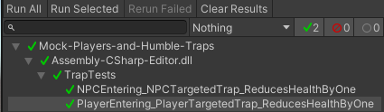

# Mock-Players-and-Humble-Traps


#
[TrapTests.cs](Mock-Players-and-Humble-Traps/Assets/Tests/Editor/TrapTests.cs)
```markdown
using NUnit.Framework;
using NSubstitute;
using System.Collections;
using System.Collections.Generic;
using UnityEngine;


public class TrapTests
{

    [Test]
    public void PlayerEntering_PlayerTargetedTrap_ReducesHealthByOne()
    {
        Trap trap = new Trap();
        IPlayer playerMover = Substitute.For<IPlayer>();
        playerMover.IsPlayer.Returns(true);
        trap.HandleCharacterEntered(playerMover, TrapTargetType.Player);
        Assert.AreEqual(-1, playerMover.Health);
    }
    [Test]
    public void NPCEntering_NPCTargetedTrap_ReducesHealthByOne()
    {
        Trap trap = new Trap();
        IPlayer playerMover = Substitute.For<IPlayer>();
        playerMover.IsPlayer.Returns(false);
        trap.HandleCharacterEntered(playerMover, TrapTargetType.NPC);
        Assert.AreEqual(-1, playerMover.Health);
    }
}
```
#
A quite useless [build](https://bigelowd-erau.github.io/Mock-Players-and-Humble-Traps/) for you to explore.
